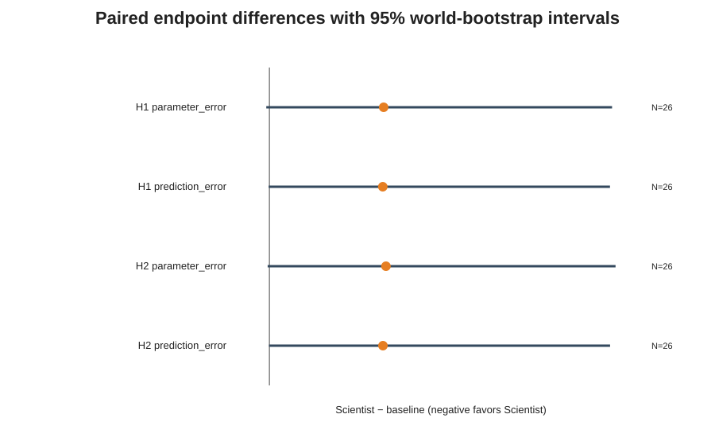

# Falsify: Experimental Reasoning in LLM Agents

**Can a language-model agent choose experiments that identify a hidden physical system more effectively than simple experiment-selection baselines?** Falsify studies that question in controlled, partially observed simulations. We evaluate observable experimental choices and measured outcomes—not private reasoning traces or claims that a model “understands” physics.

## The question

An agent interacts with a hidden damped oscillator, sees sampled displacement observations, and chooses interventions under a finite budget without seeing the oscillator's physical parameters. A common evaluator fits the system from each policy's observations and scores parameter identification and prediction on held-out trajectories. The ScientistPolicy is compared with seeded-random and predeclared fixed-design policies on paired worlds.

## First result: V0.1

> **V0.1 result:** In 26 retained matched noisy worlds, the preregistered ScientistPolicy did not outperform either RandomPolicy or FixedDesignPolicy on the co-primary parameter-identification and held-out-prediction endpoints. Typical ScientistPolicy runs were descriptively competitive, but behavioral and infrastructure failures exposed reliability as a major part of the problem.



The plot shows ScientistPolicy minus baseline: **negative favors ScientistPolicy**. Intervals are 95% paired-world bootstrap intervals. Both co-primary endpoint intervals cross zero for both comparisons; neither H1 nor H2 was supported. This is not evidence of superiority. Four of 30 primary worlds were excluded by the frozen matched-block rule after terminal ScientistPolicy infrastructure failure on retry, so the retained comparison also has policy-specific, potentially informative missingness.

The [human-authored V0.1 findings memo](research/v0.1-findings-memo.md) interprets the result, limitations, and next questions. The separate [generated factual findings record](research/findings-v0.1.md) preserves analysis outputs and accounting. The [preregistration](research/preregistration-v0.1-prereg-4.md), [protocol](research/protocol.md), [metric definitions](research/metrics-v0.1.md), and complete [derived confirmatory artifacts](results/derived/v0.1-confirmatory/) provide the methods and evidence.

## What Falsify measures

Falsify separates hidden physical reality, public observations, experimental policy, and evaluator. Under a fixed intervention budget, the policy proposes experiments; observations are generated from the hidden system; then a deterministic, policy-independent evaluator estimates parameters and scores prediction on fixed held-out probes. Failures are recorded, not silently repaired or removed as inconvenient outcomes. Clean and noisy observation conditions are kept distinct, and the confirmatory hypotheses use only the preregistered noisy condition.

## What V0.1 taught us

The noisy-condition ScientistPolicy median errors were descriptively near or slightly below baseline medians, while its means were much worse. One retained behavioral failure received the preregistered endpoint score of 1.0 and materially affected the mean. Reliability is therefore part of the measured performance, not a nuisance to remove in a successful-runs-only comparison. In the clean descriptive condition, none of ten ScientistPolicy slots completed successfully (seven terminal infrastructure slots and three behavioral failures), leaving no usable ScientistPolicy clean-performance sample.

The full prereg-4 campaign reached terminal state across 120 logical slots and 140 attempts including retries. Persisted analysis reports accuracy, intervention use, failures, uncertainty, tokens, latency, and **recorded provider cost**. That recorded provider charge was about $0.77; it excludes engineering labor and compute costs outside provider billing.

## Current limitations

This is one oscillator environment, one model treatment, and one ScientistPolicy repetition per world. Random and fixed designs were strong on this relatively simple, identifiable task. Four primary matched blocks were excluded because ScientistPolicy infrastructure failures persisted after the permitted retry; this policy-specific missingness may be informative. The behavioral-failure penalty is intentionally part of the endpoint and creates a skewed distribution. The failed clean treatment prevents a clean/noisy ScientistPolicy comparison. These findings do not establish general scientific reasoning, physics understanding, transfer to other models or systems, or superiority over an LLM open-loop design.

## Research roadmap

### V0.2 — Environment generalization

The next study should ask whether conclusions change in systems with different identification geometry—potentially coupled oscillators, RLC-style systems, or other qualitatively distinct dynamics. This is future work, intended to test generalization and identify regimes where adaptivity has a real opportunity to improve on broad generic coverage. Environments and protocol are not yet claimed as results.

### V0.3 — System-one intervention study

Future work will compare a primary model alone with a fast-advisor/system-one intervention followed by the primary model, alongside appropriate controls or ablations. It should test effects on experiment choice, failures, cost, latency, and possible anchoring. **No advisor intervention was tested in V0.1, and its effect is unknown.**

## Reproduce the V0.1 analysis

The published statistical result can be regenerated from persisted, frozen evaluator scores; reproducing it does not require rerunning the ScientistPolicy campaign or contacting a model provider:

```bash
julia +1.12.7 --project=. -e 'using Pkg; Pkg.instantiate()'
julia +1.12.7 --project=. scripts/analyze_confirmatory_v0_1.jl
```

If needed, frozen evaluator scores can separately be materialized offline from persisted runs (also with no provider calls):

```bash
julia +1.12.7 --project=. scripts/materialize_confirmatory_scores_v0_1.jl
```

Analysis and figures are generated by the deterministic DAL-125 path from persisted artifacts; see [analysis provenance](results/derived/v0.1-confirmatory/analysis-provenance.json). Do not run the live campaign merely to reproduce the statistics.

## Repository layout

- `src/` — environment, protocol, policies, evaluator, and artifact code
- `research/` — protocol, preregistrations, metrics, and findings
- `results/` — persisted raw and derived experimental artifacts
- `scripts/` — execution, materialization, analysis, and smoke entry points

## Development

Requires Julia 1.12.7. Instantiate dependencies, run package tests, and run the deterministic package smoke check:

```bash
julia +1.12.7 --project=. -e 'using Pkg; Pkg.instantiate()'
julia +1.12.7 --project=. -e 'using Pkg; Pkg.test()'
julia +1.12.7 --project=. scripts/smoke.jl
```

The smoke script is a package/bootstrap check, not a benchmark result.

## Provider credentials

Live ScientistPolicy calls use OpenRouter and read `OPENROUTER_API_KEY` from the process environment. Tests and analysis do not require provider credentials. Never commit the key; the code does not load dotenv files. Provider calls are not needed to reproduce V0.1's analysis.
